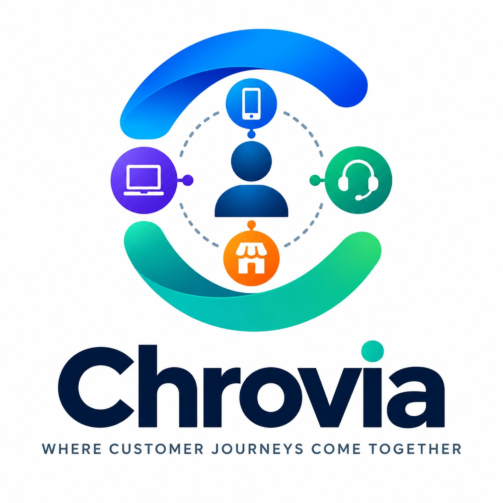
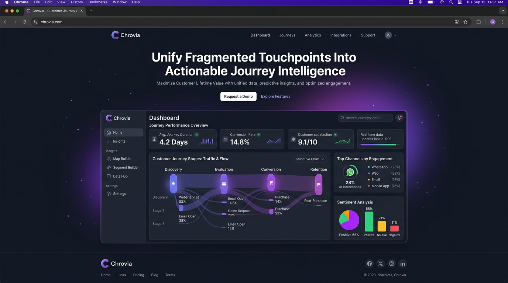
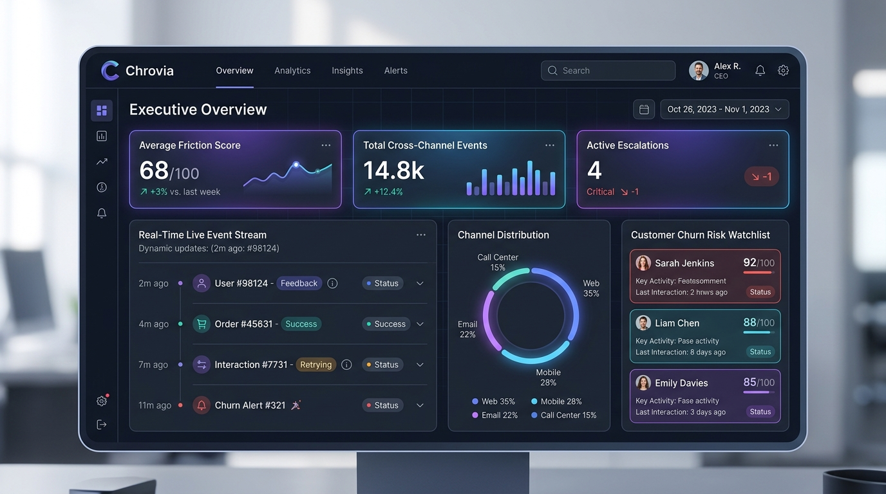
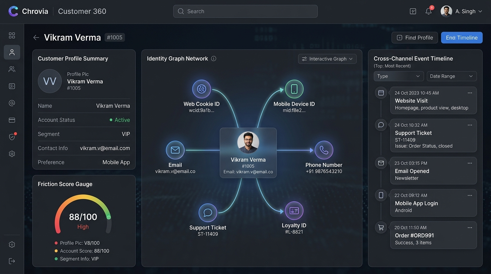
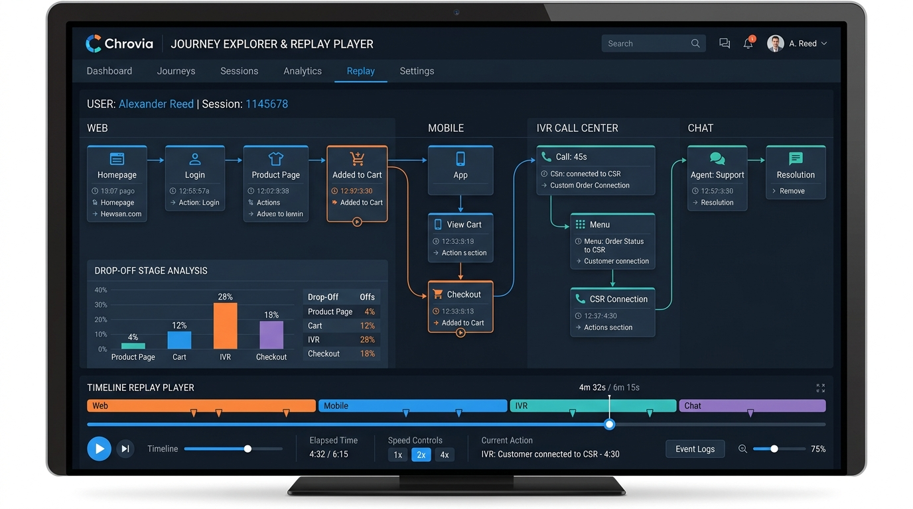
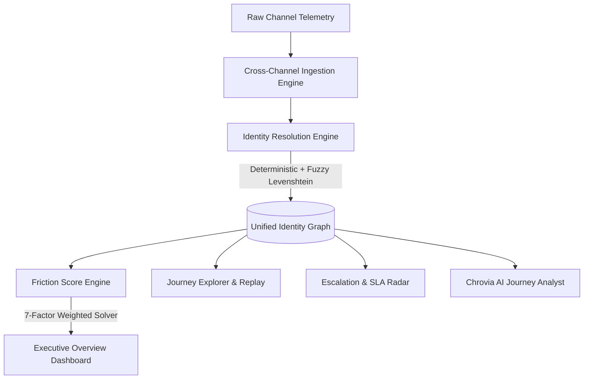

<div align="center">

  

  # CHROVIA
  ### Cross-Channel Customer Journey Intelligence Platform

  [](https://react.dev/)
  [](https://vitejs.dev/)
  [](https://tailwindcss.com/)
  [](https://github.com/shauryadoshi9/Chrovia)
  [](LICENSE)

  <p align="center">
    <b>Unify fragmented web clicks, mobile sessions, call center logs, store check-ins, and support chats into a single deterministic identity graph with real-time friction scoring and AI analytics.</b>
  </p>

  <a href="#-live-screenshots--ui-showcase"><b>UI Screenshots</b></a> •
  <a href="#-key-features"><b>Key Features</b></a> •
  <a href="#%EF%B8%8F-architecture--engine-design"><b>Architecture</b></a> •
  <a href="#-quick-start"><b>Quick Start</b></a> •
  <a href="#-customer-360-case-study"><b>Case Study</b></a>

</div>

---

## 🌟 Overview

Modern enterprise customer interactions are severely fragmented across siloed communication channels:
- A user browses products on a **Mobile App**.
- Experiences a payment gateway timeout on the **Web Storefront**.
- Calls the **Call Center** in frustration with long IVR hold times.
- Visits a **Physical Retail Store** or initiates a **Live Support Chat**.

**Chrovia** solves cross-channel journey fragmentation by ingesting normalized cross-channel telemetry, applying a **Deterministic + Levenshtein Fuzzy Identity Solver**, running a **7-Factor Journey Friction Engine**, and providing natural language **AI Journey Analytics**.

---

## 📸 Live Screenshots & UI Showcase

### 1. Public Home Landing Page


### 2. Executive Overview Dashboard & Real-Time Event Stream


### 3. Customer 360 View & Cross-Channel Identity Graph


### 4. Journey Explorer & Interactive Timeline Replay Player


---

## 🚀 Key Features

### 🆔 1. Cross-Channel Identity Graph & Resolution
- **Deterministic Node Linking**: Links Web Cookies (`web_id`), Mobile Identifiers (`mob_id`), Phone Numbers, Email Accounts, and CRM Profile IDs.
- **Fuzzy Levenshtein Matcher**: Identifies potential duplicate profiles based on fuzzy name/contact matching with confidence scoring and false merge safeguards.
- **Identity Resolution Sandbox**: Interactive sandbox for testing identity merge algorithms in real-time.

### ⚡ 2. 7-Factor Journey Friction Engine
Computes a real-time journey friction score ($0 \dots 100$) for every customer based on weighted telemetry signals:
- $w_1$: Payment Gateway Errors & Timeouts (#504 / #502)
- $w_2$: IVR Wait Time & Escalation Threshold Breaches
- $w_3$: Repeated Contact Frequency & Channel Hopping Rate
- $w_4$: Agent Re-Explanation Overhead (Re-telling story to support)
- $w_5$: Ticket Resolution SLA Breaches
- $w_6$: Cart & Step Abandonment Rate
- $w_7$: Negative CSAT / Sentiment Signals

### 🔍 3. Interactive Journey Explorer & Replay Player
- **Visual Flow Graph**: Node-based visualization of customer touchpoints with stage color-coding.
- **Journey Replay Player**: Interactive timeline player with **Play / Pause / Step Forward / Speed Controls (1x, 2x, 4x)** to simulate customer journeys in real-time.
- **Selected Node Micro-Details**: Click any step to inspect channel, timestamp, payload, and friction impact.

### 📉 4. Drop-Off & Root Cause Funnel Analysis
- 5-stage conversion funnel tracking drop-offs across **Landing Page $\rightarrow$ Product Browsing $\rightarrow$ Cart Addition $\rightarrow$ Checkout Payment $\rightarrow$ Order Confirmation**.
- Quantitative breakdown of primary drop-off root causes (e.g., HDFC Gateway Timeout #504).

### 🚨 5. Escalation Center & SLA Breach Radar
- Real-time queue tracking active customer support escalations.
- SLA countdown timers highlighting expired and critical incidents.
- Supervisor override action tools for instant issue resolution.

### 🔄 6. Repeated Contact & Channel Hopping Intelligence
- Channel hopping sequence analytics tracking cost impact per contact cycle.
- Highlights customer frustration caused by uncoordinated channel transfers.

### 🛡️ 7. Churn Risk Intelligence & Watchlist
- Churn correlation radar connecting journey friction scores to cancellation risk.
- Automated retention playbook recommendations for high-risk accounts.

### 🤖 8. Chrovia AI Journey Analyst
- Natural language query interface grounded in live identity graph data and normalized event streams.
- Provides direct clickable audit trace evidence links to customer profiles and escalation tickets.

### 🔐 9. Genuine Google OAuth & Interactive OTP Auth
- **Google OAuth 2.0**: 1-Click login with Google accounts (`aarav.shah@gmail.com`, `vikram.verma@gmail.com`, `ananya.sharma@gmail.com`).
- **Interactive OTP Verification**: 4-digit security code confirmation for Email/SMS user registration with live countdown timer and auto-fill testing tools.
- **Password Authentication**: Strict password validation and saved user credentials.

### 🌓 10. High-Contrast Dark & Light Theme System
- Complete CSS token design system guaranteeing 100% text clarity and badge visibility in both Dark (`#0B0F19`) and Light (`#F1F5F9`) modes.

---

## 🛠️ Tech Stack & Architecture



- **Frontend Core**: React 19, JavaScript ES6+
- **Build Tool**: Vite 6 (Lightning-fast HMR)
- **Styling**: Vanilla CSS Design Tokens, Glassmorphism, Tailwind Color Palettes
- **Icons**: Lucide React
- **Data Engine**: Deterministic & Levenshtein Graph Solver, Pearson Correlation Solver

---

## 💻 Quick Start & Setup

### Prerequisites
- **Node.js**: `v18.0.0` or higher
- **npm**: `v9.0.0` or higher

### Installation

1. **Clone the Repository**:
   ```bash
   git clone https://github.com/shauryadoshi9/Chrovia.git
   cd Chrovia
   ```

2. **Install Dependencies**:
   ```bash
   npm install
   ```

3. **Start Development Server**:
   ```bash
   npm run dev
   ```
   Open your browser at `http://localhost:5173`.

4. **Build for Production**:
   ```bash
   npm run build
   ```

---

## 🧑‍🤝‍🧑 Stitched Customer Case Study: Vikram Verma (#1005)

| Customer Attribute | Details |
| :--- | :--- |
| **Customer Name** | **Vikram Verma** |
| **Customer ID** | `#1005` |
| **Segment** | Premium HNW |
| **Overall Friction Score** | **88 / 100 (CRITICAL)** |
| **Linked Identifiers** | Web Cookie `web_usr_1005`, Mobile Device `mob_dev_1005`, Call Log `call_9901`, Support Ticket `ESC-15` |
| **Stitched Timeline** | • **09:30 AM**: Browsed Smart Watch on Web<br>• **09:42 AM**: Attempted Checkout on Mobile App (Payment Error #504)<br>• **09:55 AM**: Called IVR Support (Wait Time: 12 Mins)<br>• **10:15 AM**: Escalated Ticket `ESC-15` for Payment Hold Override |

---

## 📄 License

Distributed under the **MIT License**. See `LICENSE` for details.

---

<div align="center">
  <sub>Built with precision for Cross-Channel Customer Intelligence. Developed by <b>Chrovia Engineering Team</b>.</sub>
</div>
